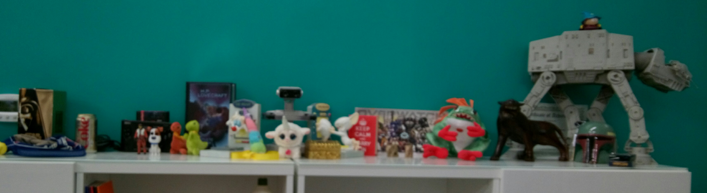

Full Stack with Auth Peer Project
=================================

Technologies
------------
* Mongo
* Express
* Angular
* Node
* Auth0
* Google Oauth Api
* git
* github

Project Description
-------------------
Our client, Prime Digital Academy: Room 2, has asked for an app to simulate the behaviour of their shelf. That is, a list of items placed on the classroom shelf.

Any visitor to the page can view the shelf, but only logged in users should be able to place objects on the shelf.

Shelf Object
------------
Items placed on the shelf should have the following data:

* description
* placer
* image url (optional)

Use branching and github effectively. Prioritize your tasks. We are directly modeling a work assignment and part 1 of this assignment is to have an 'EOD Push' - End of Day Push to remote origin master. That is, as you wrap your day's work, merge what works to master and push to github. Incomplete or not-working code can stay on it's own branch and should not be merged to master. This branch can, however, be pushed to github so it is available in remote.

Auth0 reference: https://github.com/devjanaprime/auth0Example

Branching reference: https://github.com/devjanaprime/MEANie
